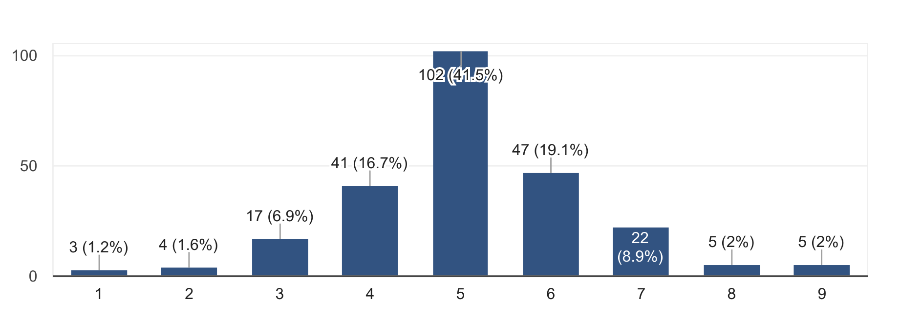

DoCSoc Member Experience Survey 2017 Report
================================

Hello there, lovely members of DoCSoC! Back in April, we asked you to fill out a survey for us regarding your experience with DoCSoc this past year. Well, we've taken a long hard look at the data and the results have been very educational for us and will certainly aid us in trying to improve DoCSoc as a community and society for this upcoming year.

Anyways, we'd just like to take this chance to show you the results and talk about some of the responses!

# Table of Contents
- #### The split between Academic and Social Events 
- #### Your Favourite Events
- #### Your Not-so-Favourite Events
- #### Your thoughts on events with other societies
- #### Other Suggestions
- #### Looking ahead to the future

## The split between Academic and Social Events

Test:

This was a surprisingly good result - I mean, look at those sexy curves on that almost-Gaussian-Distribution! This was something we were initially somewhat concerned with, as we've previously heard complaints (from both sides) before. However, it looks like our concerns were unfounded......

On a more serious note, we'll continue to work hard to bring you a large range of both social and academic events this upcoming year, so stay tuned!

## Your Favourite Events (and why)

__Bar Nights__ were by far the most popular events - with over 80 responses mentioning either a specific bar night or all of them collectively. This was a *shocking* revelation to us as we would never have expected that large quantities of free alcohol could be so incredibly popular amongst university students. We're glad that DoCSoc's bar nights have gained the popularity and legendary reputation that they have; in fact the College Union has now asked us to switch our venue to Metric due to the large volumes of people who attend. Our commitment to getting you alcohol will not waver, and you can expect the very same high quality bar nights this year!

**ICHack** was by far the most expensive event and took months of preparation from the committee, and it's good to see that our hard work has been appreciated with the hackathon being voted to 2nd place. Our ambitions were very high this year, going from a measly 150 attendees in the previous ICHack to a staggering 335, so we're _really_ happy that you guys enjoyed it as much as the committee almost died organizing.

_"It was organised extremely well and was really fun"_

_"Really huge event. Free food. Great prizes. Great sponsors and establish career connections."_

_"Because Pizza. Also first Hackathon so a really cool experience. The sponsors were also super nice!"_

_"Most exciting of all the events, I had a great time and learnt a lot as well"_

_"God organization"_

_"Lit af"_

 Thanks guy <3

 
