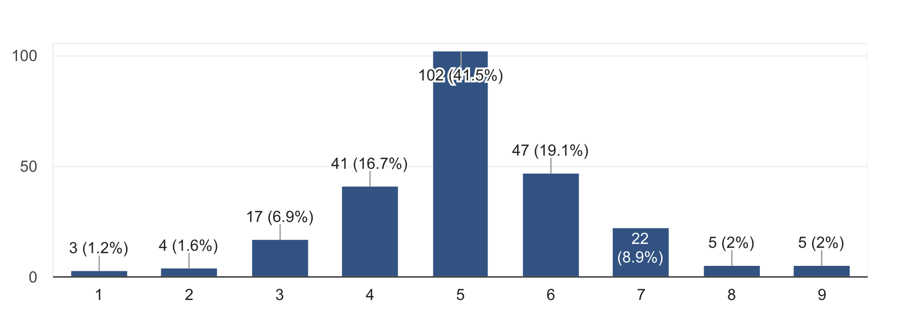

DoCSoc Member Experience Survey 2017 Report
================================

Hello there, lovely members of DoCSoC! Back in April, we asked you to fill out a survey for us regarding your experience with DoCSoc this past year. Well, we've taken a long hard look at the data and the results have been very educational for us and will certainly aid us in trying to improve DoCSoc as a community and society for this upcoming year.

Anyways, we'd just like to take this chance to show you the results and talk about some of the responses!

# Table of Contents
- #### The split between Academic and Social Events 
- #### Feedback on events this year
- #### Your thoughts on events with other societies
- #### Other Suggestions
- #### Looking ahead to the future

## The split between Academic and Social Events

This was a surprisingly good result - I mean, look at those sexy curves on that almost-Gaussian-Distribution! This was something we were initially somewhat concerned with, as we've previously heard complaints (from both sides) before. However, it looks like our concerns were unfounded......

On a more serious note, we'll continue to work hard to bring you a large range of both social and academic events this upcoming year, so stay tuned!

## Events this year

__Bar Nights__ were by far the most popular events - with over 80 responses mentioning either a specific bar night or all of them collectively. This was a *shocking* revelation to us as we would never have expected that large quantities of free alcohol could be so incredibly popular amongst university students. We're glad that DoCSoc's bar nights have gained the popularity and legendary reputation that they have; in fact the College Union has now asked us to switch our venue to Metric due to the large volumes of attendees.

_"Bevs"_

_"Good chance to meet new people from the course and from other years"_

_"A chance to sit down with friends that I otherwise only see in lectures"_

At the same, Bar Nights were _also_ the most disliked, with over 30 people putting them down as their least favourite event:

_"Im not that interested in drinking."_

_"Boring as most club and societies do this already"_

_"Union bar is too overcrowded and the service is incredibly slow"_

_"Too many dudes"_

_"bar nights and alcohol arent really my thing!"_

_"I don't drink"_

_"dont like going to pubs"_

That said, some of the "Least favourite" reasons were:

_"Had too much to drink :("_

_"I died (was lit otherwise)"_

**It's no surprise that the Bar Nights are the most controversial events - after all, we're a very diverse community of people ranging from raging alcoholics to complete teetolers. The serious criticisms of the Bar Nights fall into one of two categories: either the lack of interest in drinking, or the venue being too busy. After much debate, we've come to the consensus that the frequency of bar nights are in a good spot right now, and we will keep the number of bar nights for this upcoming year the same as last year. This doesn't mean that we're not listening to the non-drinkers; we believe we can up our game with non-alcohol social events this year without affecting the quality of the Bar Nights which are beloved by many others. We'd also like to mention that this year we'll be moving to Metric for our main Bar Nights. This should hopefully solve or mitigate a lot of issues with the congestion and long bar queues.**

**Revel** AKA **Cirque le Revel** AKA **Revel 2.0** was also another controversial event. This was our second year running Revel, and after the massive success and positive feedback we had from last year's Rooftop Revel, we had *a lot* to live up to.

_"Unlimited booze and cool venue"_

_"Variety, different to any night I've ever been on"_

_"STRIPPERS"_

_"Entertainment was great"_

_"A lot of people and a lot of fun"_

_"MAGNIFICENT"_

_"Well it was bloody brilliant. The location..."_

_"It didn't seem worth the money and it ended early"_

_"In comparison to the Rooftop from the year before it fell kind of short. It was too packed and the show acts were kind of embarrassing to watch."_

_"Quite expensive, venue wasn't big enough for everyone and they ran out of wine and water quite early on"_

_"It was not what I was expecting. The tickets were expensive and it overall wasn't worth the money."_

_"Bit overhyped, I think we could have done better for the price (compared with the last year's rooftop revel which was awesome)."_

_"Was too weird"_

A lot of the feedback we received was very similar to those of the bar night - and we do agree that generally non-drinkers did not enjoy the event as much, and many drinkers also were very critical of the venue being too loud, too small and having no "quiet area" like Rooftop Revel did. The main reason we didn't go with the Roof Gardens again this year was that they lost their license, hence we had to find an alternative. This year, though we haven't started formal planning on Revel yet, the committee is seriously considering going back to Roof Gardens (as they have regained their license).

Something else we're also taking in mind is the subsidy amount and availability of the tickets. Many DoCSoc members were unhappy that many tickets went out to +1s before they themselves had the chance to buy them, so we're considering implementing a new system that prioritizes DoCSoc members. We're still in the early stages of discussion, so nothing's for certain yet, but we are very keen on prioritising DoCSoc members whilst still having enough tickets for +1s. A budget increase for Revel has also been approved, which should also help a lot.

**ICHack** was by far the most expensive event and took months of preparation from the committee, and it's good to see that our hard work has been appreciated with the hackathon being voted to 2nd place. Our ambitions were very high this year, going from a measly 150 attendees in the previous ICHack to a staggering 335, so we're _really_ happy that you guys enjoyed it as much as the committee and organizers almost died running it.

_"It was organised extremely well and was really fun"_

_"Really huge event. Free food. Great prizes. Great sponsors and establish career connections."_

_"Because Pizza. Also first Hackathon so a really cool experience. The sponsors were also super nice!"_

_"Most exciting of all the events, I had a great time and learnt a lot as well"_

_"God organization"_

_"Lit af"_

 Thanks guys <3
 We also received very few responses where ICHack was down as least favourite event, so I can go through them all individually here:

 _"Too many people"_

 Well, we wanted to give as many people as we can the opportunity to participate. We're sorry if you feel like this compromised your enjoyment of the event. If you want to give us more details, drop us an email at docsoc@imperial.ac.uk.

 _"I didn't like that it was held at uni, made me feel like I was just spending a weekend in the place I want to get  away from. Also I didn't like any of the meals...except dominoes "_

Tieing in with the above point, the only venue we could get that would give allow us to host such a large amount of people, and not cost every committee member their kidneys, was on College Campus. In regards to the meal, we weren't allowed to do use external catering this previous year, but we're hoping to change that this year, so hopefully food should be much improved.

Our **Sponsored Talks and Workshops** were also overall well received. In particular, the **Palantir Startup** and **Netcraft Phishing for Fun and Profit** seemed to be particularly well-liked.

_"Really interactive"_

_"Fun and mostly accessible"_

_"An interesting coding challenge"_

_"The talk was very interactive and very interesting"_

_"Nice and short workshop"_

_"Fun workshop with an insight into their company, free food + bar night was cool as well"_

And amongst the criticisms we had:

_"Too much set-up for the workshop, task seemed very long and wasn't particularly engaging"_

_"Config files are boring"_

_"Speaker was not very good - more of an advertisement than a technical/academic talk"_

_"I fell behind and was unable to catch up due to teh format of the presentation. It seemed liek others had similar issues with falling behind. I still gained something from it but it would have been nice if there was more information about how the systems worked rather than being so focused on configuring it quickly to get it working"_

This category of events is a difficult one for us to work on, as the events themselves are run by our sponsors. We're happy that overall people seemed to enjoy them, however we've also passed on feedback onto our sponsors in order for them to provide a better experience for our students during their workshops and talks this year.

 
